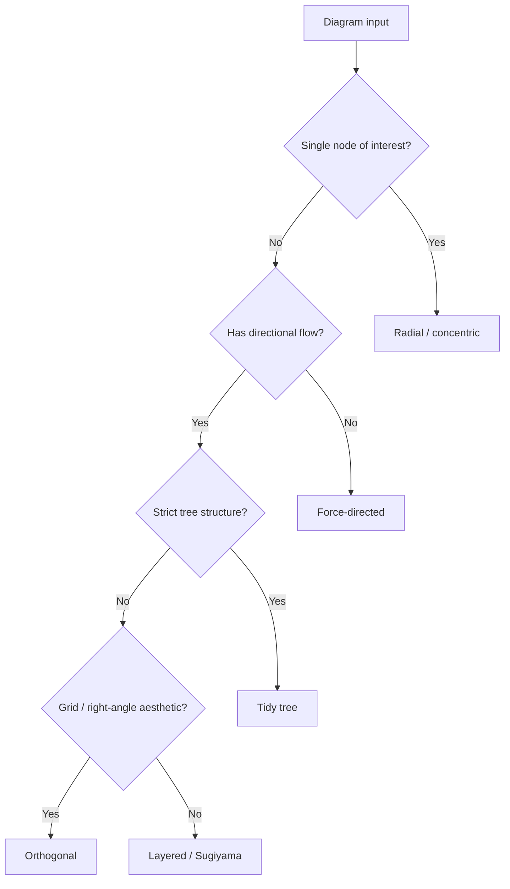
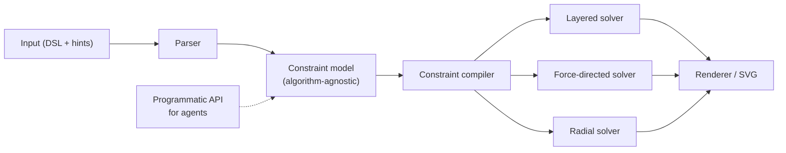
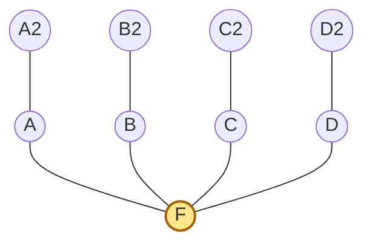
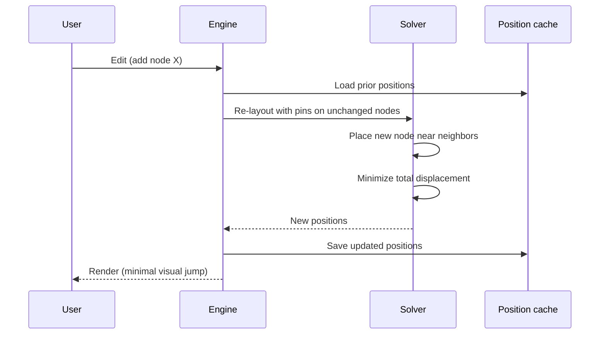
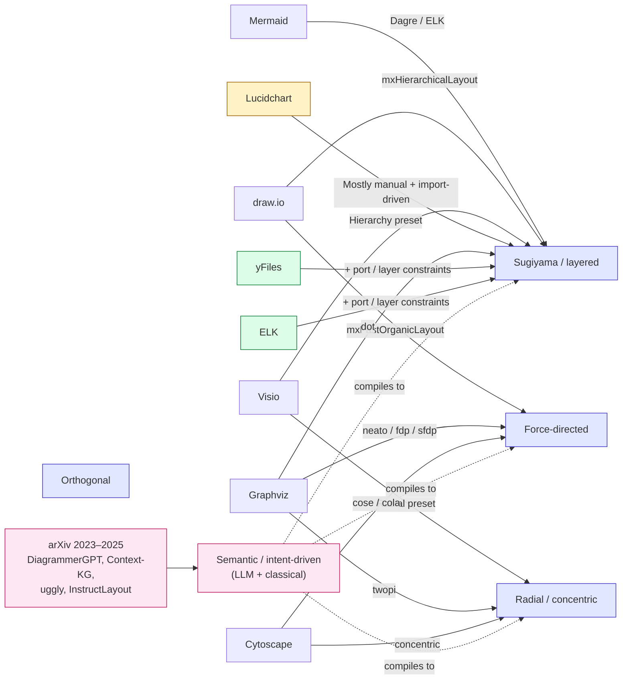

# Diagram Layout Engine — Design Notes

> **Status:** draft for elaboration
> **Audience:** software architect (system design), business analyst (usability/UX), coding agent (implementation)
> **Goal:** decide the shape of a diagram layout engine that beats Mermaid on the things people actually complain about: wrong-side ports, ignored intent, no focus mode, jittery re-layouts.

---

## 0. Problem statement

Mermaid and similar tools apply one algorithm (usually layered/Sugiyama) to every diagram and ignore author intent. Users hit three recurring frustrations:

1. **Geometric correctness** — arrows attach to the wrong side; "in" and "out" are not honored as semantically opposite.
2. **Intent expression** — no way to say "focus on this node," "this group stays together," or "A is above B."
3. **Stability** — a small edit to the source re-flows the whole diagram, breaking the user's mental map.

This document proposes an engine built around **a small set of layout algorithms** plus **a constraint/hint system** that authors use to shape the result, with **incremental layout** as a first-class concern.

---

## 1. Pick the base algorithm by diagram type

> One algorithm cannot serve all diagram types well. Supporting **two modes well** (layered + force-directed) covers ~90% of practical cases. Add radial as a third mode for focus views.

| Diagram type                          | Algorithm family       | Why                                           |
| ------------------------------------- | ---------------------- | --------------------------------------------- |
| Flowcharts, dependencies, pipelines   | Layered (Sugiyama)     | Directional flow is the whole point          |
| Networks, relationships, knowledge graphs | Force-directed     | No inherent direction; cluster structure matters |
| System / UML / circuits               | Orthogonal            | Right angles communicate "engineered"         |
| Trees, org charts                     | Tidy tree (Reingold-Tilford) | Specialized algorithm gives much better results |
| Focus / ego views                     | Radial / concentric    | Center the focus, rings show distance         |

**Open questions for elaboration:** which modes ship in v1? Should the engine auto-detect mode from input (the decision tree above), or require the author to pick?

---

## 2. Constraint system — the heart of the engine

> The killer feature isn't the algorithm — it's letting authors express **intent** that the algorithm respects. Ranked by bang-for-buck:

### 2.1 Port constraints **(highest priority)**

Each node declares which **side** (N/S/E/W) each edge attaches to. Fixes the #1 complaint: "in/out arrows ended up on the same side."

- ELK calls these "port sides"
- Could be inferred from edge labels (`in:` / `out:`) or explicit
- Must propagate into edge routing, not just node placement

### 2.2 Direction (global + per-subgraph)

`LR`, `TB`, `RL`, `BT` at diagram level, overridable per-cluster. Mermaid has this; the gap is per-subgraph override.

### 2.3 Focus / centric mode

Pin one node at origin, do BFS-layered expansion outward. **This is a separate layout mode**, not a hint to Sugiyama. Concentric ring placement, angular position chosen to minimize crossings. ~100 LOC for a clean implementation.

### 2.4 Grouping / clusters

"Keep these nodes near each other," optionally with a visible boundary. Nested groups should work. In layered algorithms this means compound graph support; in force-directed it's extra attraction within the group.

### 2.5 Pin position

"Node X stays at coordinate (x, y); lay everything else out around it." Critical for incremental editing.

### 2.6 Relative ordering

"A above B," "C left of D" without exact coordinates. Compiled into the algorithm's primitives (layer constraints, springs, etc.).

### 2.7 Edge routing hints

"This edge goes around the right side," "avoid crossing this region," "this edge is thick/important so give it room."

---

## 3. Architecture: separate solver from algorithm

> The single most important architectural decision. Compile constraints to algorithm-specific primitives, don't bake them into one algorithm.

Example: the constraint `above(A, B)` compiles to:

- **Layered:** `layer(A) < layer(B)`
- **Force-directed:** extra vertical spring pulling A up relative to B
- **Orthogonal:** y-coordinate constraint `y(A) < y(B)`

Benefit: swap algorithms or add new ones without rewriting the hint system. Benefit for AI agents: the constraint model is a clean target — the agent emits constraints, not coordinates.

---

## 4. Focus mode deserves its own algorithm

Trying to make Sugiyama produce a focus-centric layout is the wrong fight. The clean approach:

1. Focus node at origin
2. BFS outward; each level = a concentric ring at radius `r = level * spacing`
3. Within a ring, angular position chosen to minimize edge crossings (greedy or simulated annealing)
4. Optionally fade/shrink nodes by distance from focus

Cytoscape's "concentric" layout is the reference implementation. Small, fast, easy to read.

**Illustration** — what the result looks like for a focus node F with two BFS rings:

*(In a real radial renderer the rings are circular; Mermaid approximates the structure — neighbors around F, second-degree nodes one ring out.)*

---

## 5. Stability is the actual killer feature

> If you only do one thing better than Mermaid, do this.

Mermaid re-runs layout from scratch on every edit, so a one-character change can move every node. Users lose their place.

**Approach: incremental / constraint-preserving layout.**

- New nodes are inserted near their neighbors
- Existing nodes keep their position unless a constraint is violated
- Re-layout minimizes total node displacement subject to constraints
- Literature: "mental map preservation," "dynamic graph drawing"

**Implementation sketches:**

- For force-directed: warm-start the simulation from the previous positions
- For layered: keep prior layer assignments unless structurally invalid; re-run only crossing minimization
- Snapshot positions to the source file (as comments or sidecar) so stability survives across sessions

**Incremental re-layout flow:**

---

## 6. Input format

> Choice constrains what hints are ergonomic to express. **TBD — needs discussion.**

| Option              | Pros                              | Cons                                |
| ------------------- | --------------------------------- | ----------------------------------- |
| Mermaid-style DSL   | Familiar, terse, copy-pasteable   | Hard to express nested constraints  |
| JSON / YAML         | Easy for tools and agents to emit | Verbose for humans                  |
| Hybrid (DSL + frontmatter for hints) | Best of both                      | Two grammars to learn               |

**Recommendation:** start with a hybrid. Body in a Mermaid-like DSL for the graph; hints/constraints in a YAML frontmatter block. Agents can emit pure JSON via a programmatic API.

---

## 7. Out of scope (for v1)

To keep v1 shippable:

- ML-based layout (see prior research summary; classical wins on predictability and speed)
- 3D layout
- Animation between layouts (nice, but later)
- Hand-drawn / sketchy rendering
- Real-time collaborative editing

---

## 8. Open questions

1. Which 2–3 base algorithms ship in v1?
2. Auto-detect diagram type or author-declared?
3. How do hints survive a re-layout — coordinates, constraints, or both?
4. Rendering target: SVG only, or also Canvas / native?
5. Web-only or also a CLI / server-side renderer?
6. What's the smallest constraint vocabulary that's still useful? (Risk: too many hints = harder than just drawing it by hand)
7. How does an LLM agent best emit input — DSL with hints, or call a programmatic constraint API?

---

## 9. References — what existing tools use

> Quick survey of the algorithms behind tools we're being compared to. Useful as both prior art and as a calibration of "what users already expect."

### 9.1 Mermaid

Web-based text-to-diagram. Most popular open-source tool in this space.

- **Default engine:** Dagre — a JS port of the classic Sugiyama layered algorithm. It's been Mermaid's only engine for most of its history.
- **Optional engine:** ELK (Eclipse Layout Kernel). In Mermaid v11 it was moved into a separate `@mermaid-js/layout-elk` package; if not loaded, the system falls back to Dagre.
- **Other modes (per docs):** `tidy-tree` (hierarchical), `cose-bilkent` (force-directed). Limited coverage across diagram types.
- **Known pain points:** Dagre exhibits poor block positioning on larger graphs — nodes loosely connected to a subgroup can land far from it, and edges sometimes route through other blocks. ELK helps but is awkward to enable in many environments and renderers.

### 9.2 draw.io / diagrams.net

Free web/desktop diagram editor. Hybrid: manual drag-and-drop with optional auto-layout passes.

- **Engine:** built on **mxGraph** (now archived but still the foundation). Layout options exposed include `hierarchical`, `circle`, `organic`, `compact-tree`, `radial-tree`, `partition`, `stack`.
- **Hierarchical layout:** implemented by `mxHierarchicalLayout` — a Sugiyama-style multi-phase algorithm with tunable rank spacing, parallel-edge handling, and root positioning.
- **Force-directed:** `mxFastOrganicLayout` (Fruchterman-Reingold-style).
- **Mermaid integration:** draw.io added ELK layout support for embedded Mermaid diagrams, which produces more compact versions of large and complex flowcharts.
- **Constraints / hints:** mostly via manual positioning. Auto-layout is a "re-layout the whole page" operation rather than constraint-driven.

### 9.3 Lucidchart

Commercial collaborative diagram editor. Manual-first, with "assisted layout" features for alignment, distribution, and connector routing.

- **Auto-layout for arbitrary flowcharts:** historically limited. Community responses indicate automatic layout adjustments for flowchart visualizations are not generally available — users align/distribute manually.
- **Specialized auto-generation:** org charts from spreadsheets, ERDs from SQL (including Graphviz DOT import), UML sequence from markup.
- **Takeaway:** Lucid bets on **interactive manual editing** + **import-driven generation** rather than a strong general auto-layout engine.

### 9.4 Microsoft Visio

The grandparent of business-diagram tooling. Manual editing with several built-in auto-layout styles.

- **Re-Layout Page gallery:** Flowchart, Hierarchy, Compact Tree, Radial, and Circular — i.e., the same classical algorithm families everyone else ships, exposed as style presets.
- **Incremental editing:** Visio 2010 added auto-shift on insert — dropping a shape on a connector shifts downstream shapes out of the way, preserving the rest of the layout. This is a primitive form of stability/incremental layout.
- **Algorithm specifics:** Microsoft does not publish them; behavior matches classical Sugiyama (hierarchy), tidy-tree (compact tree), radial, and circle layouts.

### 9.5 yFiles (yWorks)

Commercial graph-drawing library. The reference implementation for "advanced" layout — what serious enterprise products license rather than build.

- **Algorithm catalog:** layered (Sugiyama), orthogonal, organic (force-directed), tree, radial, circular, plus several specialized variants (BPMN, swimlane, balloon, etc.).
- **Differentiator:** rich **constraint** and **incremental** support — partial layout, mental-map preservation, port constraints, edge grouping, layer constraints, label placement.
- **Used in:** Gartner-tier enterprise modeling tools, AWS / cloud architecture diagrammers, many bank- and telecom-internal apps.

### 9.6 ELK (Eclipse Layout Kernel)

Open-source layout engine from the Eclipse project. The "best free yFiles."

- **Primary algorithm:** ELK Layered — a substantial extension of Sugiyama with first-class **port constraints**, layer constraints, edge labels, and hierarchical (nested) graphs.
- **Other algorithms:** ELK Stress, ELK Force, Radial, Tree, Mr. Tree (compact tree), Box/Rectangle Packing.
- **Why it matters here:** ELK is the closest existing thing to "algorithm + constraints" we're proposing. Worth studying its constraint vocabulary before designing ours.

### 9.7 Graphviz (dot / neato / fdp / sfdp / twopi / circo)

The OG. CLI-based, DOT language. Every modern web tool is, in spirit, reimplementing some subset of this.

- `dot` — directed graphs; works well on DAGs and graphs with a natural "flow" (Sugiyama-family hierarchical).
- `neato` — undirected graphs using a "spring" model with energy minimization (Kamada-Kawai, 1989).
- `fdp` — force-directed for undirected graphs (Fruchterman-Reingold).
- `sfdp` — multi-scale variant of fdp for large graphs.
- `twopi` — radial layout: one node at the origin, others on concentric circles by BFS distance.
- `circo` — circular layout based on biconnected-component decomposition.
- `patchwork` / `osage` — treemap and array-based packing.

### 9.8 Cytoscape.js

JS graph library, biology origins, now general-purpose. Reference implementation for many algorithm variants.

- **Built-in layouts:** grid, circle, **concentric** (the canonical focus/radial layout), breadthfirst, cose (force-directed), random.
- **Extensions:** `cose-bilkent`, `elk`, `dagre`, `cola` (constraint-based force-directed), `fcose`.
- **Why it matters here:** for focus/radial mode, Cytoscape's `concentric` is the smallest reference implementation worth reading before writing our own.

### 9.9 Research frontier — semantic-aware and intent-driven layout (arXiv)

The classical tools above all stop at *geometric* layout. There is a small but growing arXiv literature on **semantic** layout — using the meaning of nodes/edges/queries to drive placement, not just the graph topology. This is the area most directly relevant to our "hint system" and "focus mode" ideas.

**Constraints in classical algorithms (foundational survey)**
- *Constraints in Graph Drawing Algorithms* (Tamassia et al., 1998) — older but the canonical survey of how user-defined constraints get expressed and satisfied across layered, force-directed, orthogonal, and grammar-based approaches. Essential prior art for our §2 / §3.

**Interactive intent expression**
- *User-Guided Force-Directed Graph Layout* (Balci & Luna, 2025, arXiv:2506.15860) — user sketches a rough shape (rectangle, L-shape, etc.); the system applies skeletonization and polyline simplification to extract line segments, maps graph nodes onto those segments, and feeds the result as **positional constraints** to a force-directed layout. Code at github.com/sciluna/uggly. **Directly relevant** — same problem we're solving (close the gap between user intent and auto-layout), different input modality.
- *Aesthetic Discrimination of Graph Layouts* (Klammer et al., 2018) — CNN trained to judge whether a layout "looks good"; ~96% agreement with human raters. Useful as an automatic loss signal for tuning algorithms.

**LLM- and instruction-driven diagram generation**
- *DiagrammerGPT* (Zala et al., COLM 2024) — two-stage: GPT-4 plans a "diagram plan" (entities, relationships, bounding-box layouts) in a planner-auditor feedback loop; a layout-guided generator (DiagramGLIGEN) renders it. Demonstrates that **LLMs can do reasonable spatial planning** if you give them a structured intermediate.
- *Context-KG* (2025) — natural-language query → LLM extracts intent → maps onto knowledge-graph ontology → produces a layout that **clusters semantically related nodes**. Adds Neighbor / Edge / Path "context" refinements. This is the closest published example of "focus mode driven by semantics rather than topology."
- *InstructLayout* (Lin et al., 2024, arXiv:2407.07580) — semantic graph prior + diffusion-based layout decoder; instruction-driven 2D/3D layout synthesis. Mostly aimed at posters and scenes, but the **semantic-graph-as-intermediate** pattern transfers cleanly to diagrams.
- *DiagramEval* (Liang & You, EMNLP 2025, arXiv:2510.25761) — evaluates LLM-generated SVG diagrams as **text-attributed graphs**, with separate Node Alignment and Path Alignment metrics. Useful as a benchmark/eval framework if we ever validate our output against ground-truth diagrams.
- *Ask and You Shall Receive a Graph Drawing* (Di Bartolomeo et al., 2023, arXiv:2303.08819) — probes ChatGPT's ability to *apply* graph layout algorithms via natural language. Mixed results, but documents the gap our hint system aims to close.
- *GenAI-DrawIO-Creator* (2026, arXiv:2601.05162) — uses Claude 3.7 to translate user intent into draw.io's structured diagram format, with interactive refinement. Reference implementation for the LLM-to-structured-DSL flow we expect to support.

**ML-as-accelerator (recap from earlier research summary)**
- *Accelerating network layouts using graph neural networks* (Both et al., Nature Comms 2023) — GNN-accelerated force-directed layout, 10–100× speedup, avoids "hairball" minima.
- *Deep Generative Model for Graph Layout* (Kwon & Ma, 2019) — learns layout style from examples; generalizes beyond memorized training data.

**Takeaways for our design**

1. **The semantic-aware-layout area is open and active.** Constraint-driven layout has been studied for 25+ years, but **LLM-mediated intent extraction** is genuinely new (post-2023). We are arriving at the right time.
2. **The dominant architecture is converging on:** natural-language intent → LLM extracts structured intermediate (semantic graph, constraint set, or "diagram plan") → classical layout algorithm executes it. This is essentially the architecture in our §3, validated by independent recent papers.
3. **There is no widely-used baseline for "focus / semantic emphasis" layout.** Context-KG is closest, but it's research-grade. A clean implementation could be both a product feature and a publishable contribution.
4. **Evaluation is unsolved.** DiagramEval is one of the first systematic eval frameworks. Worth adopting (or extending) if we want to claim improvements over Mermaid quantitatively.

---

### 9.10 Pattern summary

**Observations relevant to our design:**

1. **The algorithms are commodity.** Every tool ships variants of the same 4–5 classical families. Nobody's winning on algorithm choice alone.
2. **The differentiation is constraints + stability.** yFiles and ELK are the only engines with rich constraint vocabularies; Visio 2010 was the only mainstream tool to ship incremental shape-shift. That's a small field — the gap we identified is real.
3. **Lucidchart's bet** (manual editing with strong UX) is also valid evidence: when auto-layout is mediocre, users prefer manual control. We need our hint system to be either **clearly better** than typing coordinates, or **invisible** when it just works.
4. **ELK is the closest prior art** to what we're proposing. Studying ELK's layout options spec is the highest-leverage reading before locking our v1 constraint vocabulary.

---

## 10. Suggested next steps

1. Pick the input format (Section 6) — everything else depends on it
2. Lock the v1 constraint vocabulary (Section 2) — explicit list, nothing more
3. Spike: implement layered + focus modes on a toy graph with 3–4 hints, end-to-end
4. Decide stability mechanism (Section 5) before any UI work
5. Read the ELK layout options spec (Section 9.6) before locking the constraint vocabulary
6. Read these arXiv papers (Section 9.9) before designing the intent layer:
   - *User-Guided Force-Directed Graph Layout* (2506.15860) — sketch-to-constraint pipeline
   - *Context-KG* — LLM-driven semantic clustering for graph layout
   - *DiagrammerGPT* — LLM-as-planner pattern with auditor feedback loop
